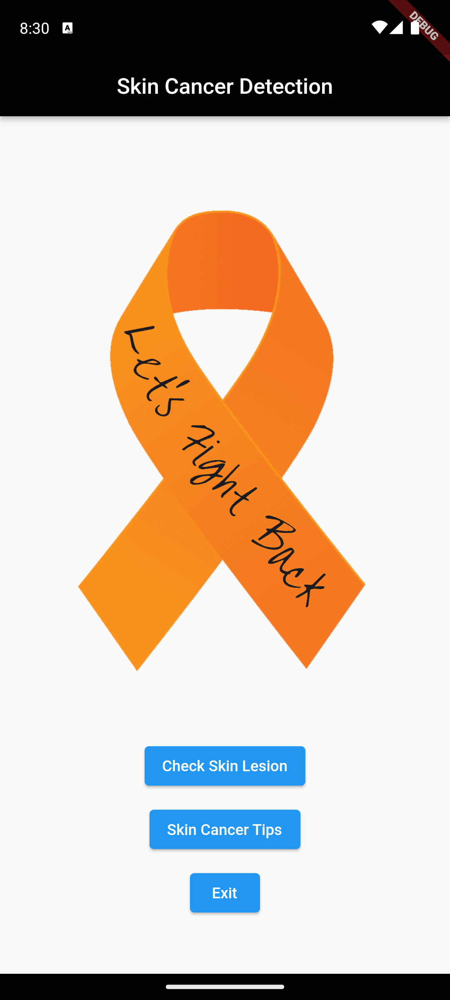
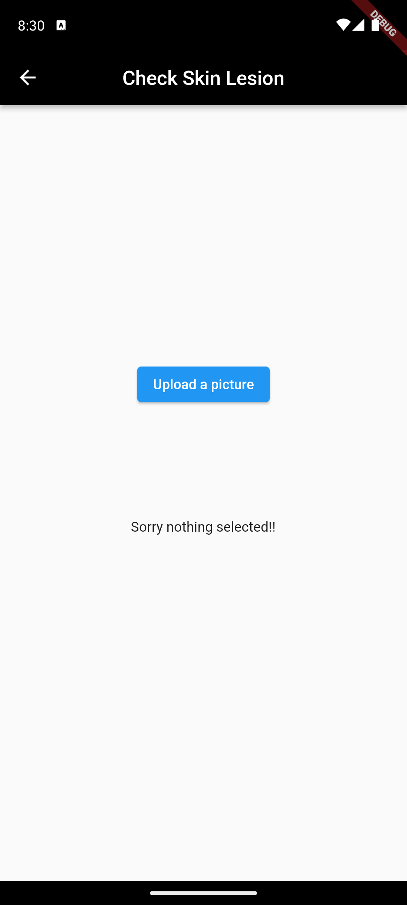
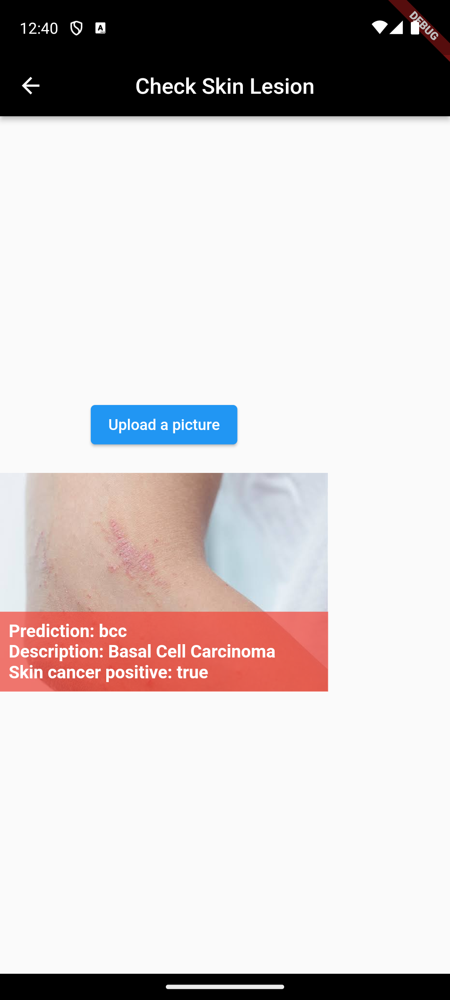
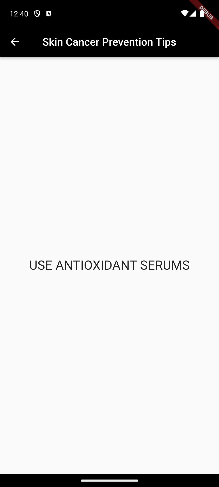

# SkinDoc
A Flutter App that enables the user to click a photo/upload from gallery of a Skin Lesion, and determine, what type of Skin Lesion it is, or even if it is the result of Skin Cancer.
It classifies the image into one of these 7 classes :

   1. bkl: Benign Keratosis-like Lesions,

   2. nv: Melanocytic Nevi (Moles),

   3. df: Dermatofibroma,
    
   4. mel: Melanoma,
    
   5. vasc: Vascular Skin Lesions,
    
   6. bcc: Basal Cell Carcinoma,
    
   7. akiec: Actinic Keratoses and Intraepidermal Carcinoma

while also determines if it's cancerous or not.

## Overview

The app uses the [HAM10000](https://dataverse.harvard.edu/dataset.xhtml?persistentId=doi:10.7910/DVN/DBW86T) dataset from Harvard Dataverse for detecting Pigmented Skin Lesions. 

A pre-trained MobileNet model was fine-tuned using Keras to classify the images into 7 distinct categories. **The final model achieves a validation accuracy of 75.3%.**

To deploy this on mobile, the model was converted from a `.h5` format to a `.tflite` format, enabling efficient, on-device inference in the Flutter app via the `tflite_flutter` package. 

SkinDoc allows users to capture or upload an image, preprocesses it, and feeds it to the edge model to output a prediction in real-time. It also provides random, hard-coded tips to help prevent skin cancer (with future updates planned to fetch dynamic tips).

## Features and Interfaces

| Home Screen | Check Skin Lesion Screen | Result after Uploading Image | Skin Cancer Tips Screen |
| :---: | :---: | :---: | :---: |
|  |  |  |  |

### Home Screen

Implemented a simple UI design, with a logo, and three buttons:

1. Check Skin Lesion
2. Skin Cancer Tips
3. Exit

### Check Skin Lesion Screen

A single button to upload the image (whether it be clicking a picture or uploading from gallery) you want to check.

### Result after Uploading Image

Results display the classification of the Skin Lesion, as well as show if it could be Skin Cancer, with color coding:
- 🟢 **Green:** Negative
- 🔴 **Red:** Positive

### Skin Cancer Tips Screen

Provides a random tip to help safeguard yourself from getting Skin Cancer.

## Model Training

The data preprocessing, exploratory data analysis, and model training pipeline can be found in the [ModellingSkinLesion.ipynb](./ModellingSkinLesion.ipynb) notebook included in this repository.

## Packages Used

[tflite_flutter](https://pub.dev/packages/tflite_flutter)

[Image_Picker](https://pub.dev/packages/image_picker)

[Image](https://pub.dev/packages/image)

 ## How to use the app

Download the SkinDoc.apk file from the repository and use directly.

## How to run the Project

### Install Flutter and it's other dependencies.

Follow the instruction mentioned in [this](https://docs.flutter.dev/get-started/install) website according to your operating system.

Run <code>flutter doctor</code> in the terminal to check if all the dependencies are installed.

Ensure tick mark in all the dependencies, if not follow the instructions provided below the dependency in the terminal.

### Cloning the project

Press the drop down Code button and copy the http link and use `git clone 'http link here'` to clone the project.

### Running the project

After installing all the dependencies, open `skindoc/lib/main.dart` and configure device in the bottom right corner (for vscode) then go to `Run => Start Debugging (F5)`.

This will start the app in your device, whether it be virtual or the one you connected to the computer using the instructions from the previous step.

## Contributing to the project

For contribution to the project, follow these instructions:

1. Create a separate branch for your feature.

2. For new feature follow [these](https://dart.dev/effective-dart/style) guidelines.

3. The naming of classes and functions should reflect their application.

## Tech Stack Used

## References

1. [HAM10000 Dataset from Harvard Dataverse](https://dataverse.harvard.edu/dataset.xhtml?persistentId=doi:10.7910/DVN/DBW86T)

2. [Flutter Get Started Page](https://docs.flutter.dev/get-started/install)

3. [Skill Icons](https://github.com/tandpfun/skill-icons)

Developed by <b>Rishabh Dewangan</b>